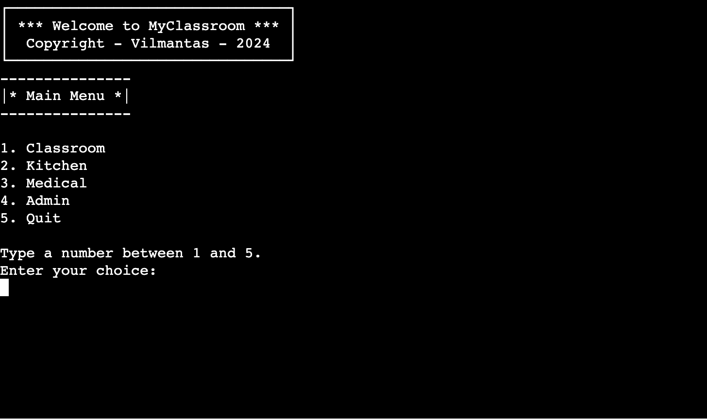
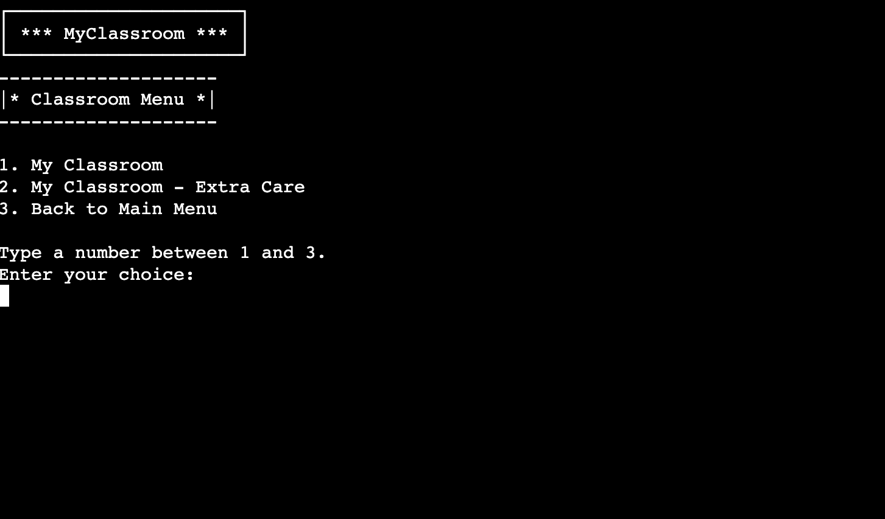
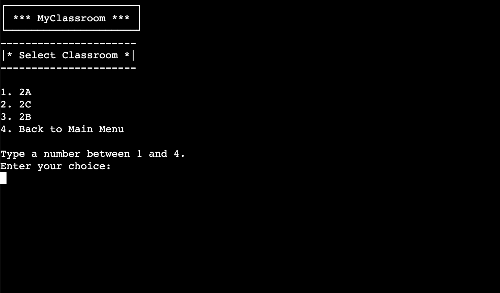
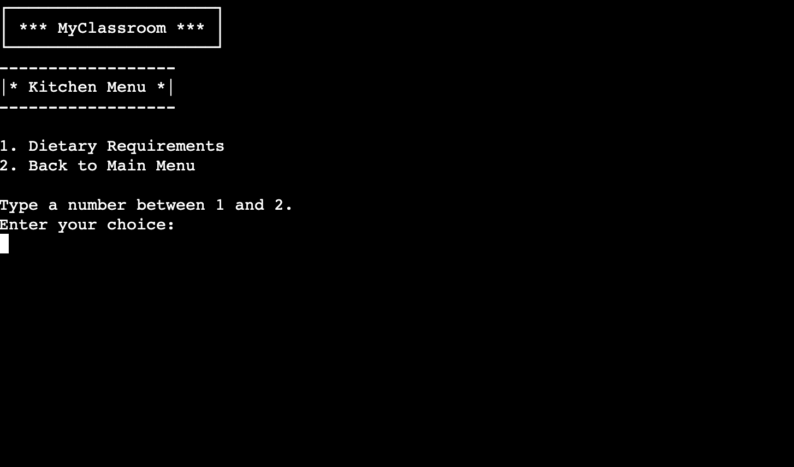
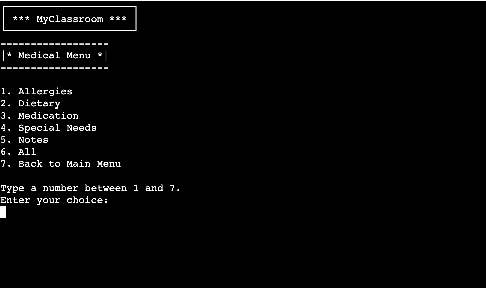
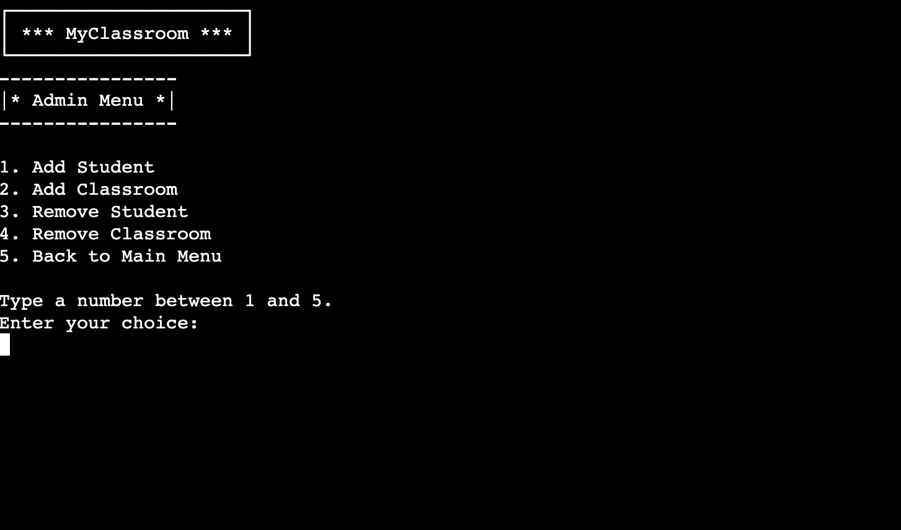
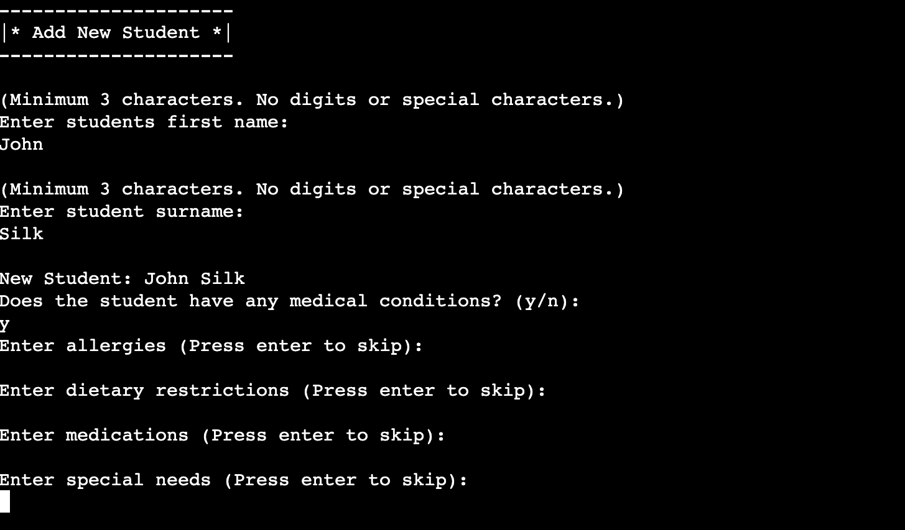
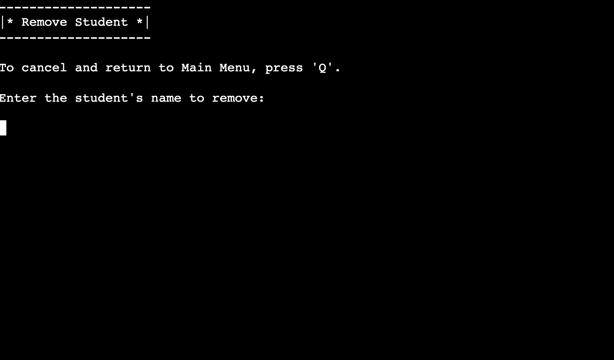
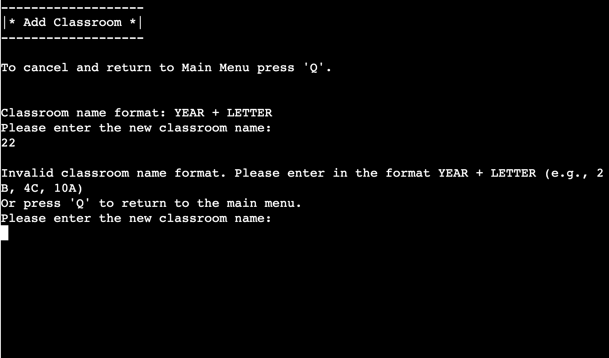
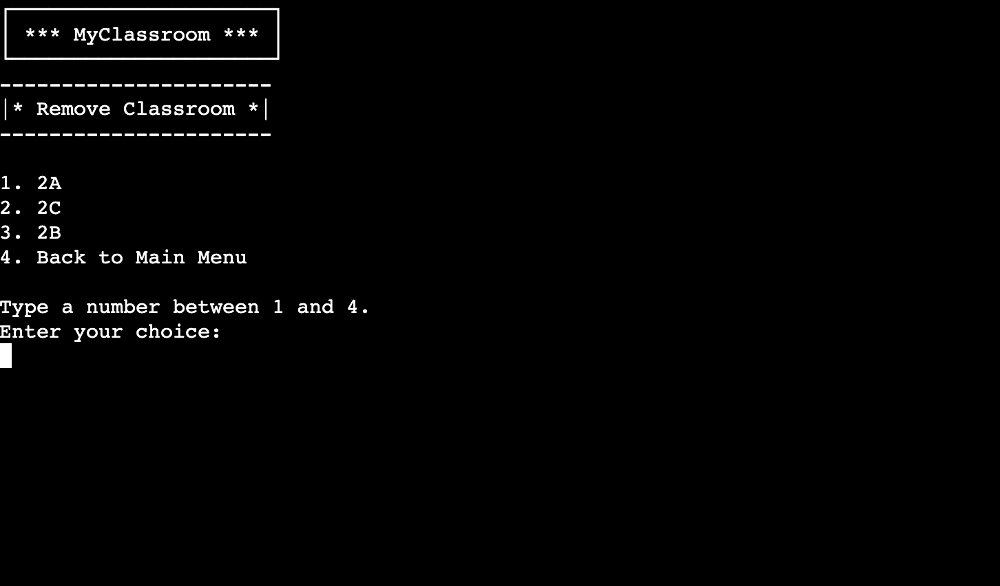

# MyClassroom: Empowering Teachers, Supporting Every Child

## Introduction

MyClassroom is a command-line interface application running in a Python terminal. A classroom management tool born from an understanding of the diverse needs of students and the challenges faced by teachers in addressing them. MyClassroom aims to simplify the complex task of classroom management while ensuring that every child receives the care and attention they deserve. 

With MyClassroom, teachers gain access to a simple overview of their classrooms, allowing them to track students' medical or dietary needs, preferences, and behaviours effortlessly. From dietary restrictions to social anxieties, MyClassroom empowers teachers to provide personalized support, fostering an inclusive and nurturing learning environment for all.

## Project Inception

In the heart of every classroom lies a world of diversity, where each child brings their unique needs, fears, and joys. And it happens that we are lucky to have one joyful little person, who sometimes needs a little extra attention and care. I've often wondered at the incredible dedication of teachers who tirelessly work to ensure that every child feels safe, understood, and valued.

Little Joyful Person's journey sparked my curiosity about the complexities teachers face in managing classrooms. How do they remember each child's special instructions, fears, and preferences amidst the whirlwind of daily activities? How do they maintain a nurturing environment while juggling diverse needs and personalities?

I wondered about the tools available to teachers for sharing this important information across departments and the strategies for seamlessly transitioning responsibilities when a teacher is absent. These reflections ignited the idea for MyClassroom – a simple software solution aimed at supporting teachers and enhancing the educational experience for every child. MyClassroom is a commitment to ensuring that every child receives the care and attention they deserve. With MyClassroom, teachers can effortlessly access a comprehensive overview of their classrooms, allowing them to track students' needs, preferences, and behaviours with ease. From dietary restrictions to social anxieties, MyClassroom empowers teachers to provide personalized support, creating an inclusive learning environment for all.

## User Stories

- As a teacher, I want easy access to a classroom overview with all students listed.
- As a teacher, I want the ability to filter children who may require additional assistance in the class.
- As a kitchen worker, I need access to any additional dietary requirements before preparing meals for the school.
- As a teacher or medical personnel, I want to be able to filter all children in school based on specific criteria such as allergies, dietary requirements, medications, or special needs.
- As a teacher, I want to add a new student to the classroom.
- As a teacher, I want to create a new classroom.
- As a teacher, I want to remove a student from the class.
- As a teacher, I want to remove a classroom.

## Flowchart


## Design

The design of the terminal interface for this project is intentionally kept minimalistic and raw, in line with the simplicity of a command-line interface. The focus is on functionality and usability rather than aesthetic appeal.

The interface primarily consists of plain text, with the exception of tables used to represent classroom data. These tables are drawn dynamically to provide a structured view of the classroom information.

To maintain clarity and simplicity, no colours or styling elements have been added to the interface. This decision was made to ensure that the interface remains accessible and easy to navigate for users who may be unfamiliar with more complex graphical interfaces.

Despite its simplicity, the interface effectively fulfils its purpose. It provides users with a straightforward menu system that allows them to easily access the necessary functionalities of the application. 

## Features

### Main Menu



- Displays MyClassroom logo.
- Utilizes a command line interface for menu navigation.
- Features 4 main menu branches: "Classroom", "Kitchen", "Medical", and "Admin", each leading to a submenus.
- Includes a "Quit" option, simulating program exit.

### Classroom Menu





- Submenu within the main menu.
- Options:
    - Display the full worksheet for a chosen classroom.
    - Display only students with medical assistance requirements for a chosen classroom.
- Option to return to the main menu.

### Kitchen Menu



- Displays students with allergies or dietary requirements for meal preparation.
- Excludes students without any requirements from the displayed table.
- Option to return to the main menu.

### Medical Menu



- Offers multiple filtering options, each displaying a table for each classroom:
    - **Allergies:** Lists all students in the school with any allergies.
    - **Dietary Requirements:** Displays all students in the school with any dietary restrictions.
    - **Medications:** Shows students in the school who are currently taking or require medications.
    - **Special Needs:** Provides information on students with any special needs.
    - **Medical or Behavioural Notes:** Displays any medical or behavioural notes for students.
    - **All Students:** Displays a table with all students in the school and their respective information.

### Admin Menu



- Provides administrative functionalities:

    - **Add Student:**

        

        - Guided menu for entering new student details, including:
            - Name and surname (Minimum 3 alphabetical letters, may include a space followed by another name)
            - Medical requirements (Option to indicate if the student has any medical needs)
            - Detailed medical information if applicable (Allergies, Dietary Requirements, Medications, Special Needs, Notes)
    - **Remove Student:**

        

        - Search for a student by name and remove if found.
    - **Add Classroom:**

        

        - Creation of a new classroom with a combination of school year (1 to 12) and classroom letter.
    - **Remove Classroom:**

        

        - Select an existing classroom to remove.

### Future Features

- **Birthday Tracker:**
    - Ability to track upcoming birthdays, allowing teachers to prepare and celebrate with students.
- **Automatic Classroom Naming:**
    - Incrementation of classroom names by year at the start of a new school year.
- **User Authentication and Logging:**
    - Different access levels for teachers and departments, with logging capabilities.
- **Daily Activity Tracking:**
    - Option to record daily activities or individual child's progress for better monitoring.
- **Exportable Worksheets:**
    - Ability to export worksheets in report format for sharing with parents or during teacher meetings.
- **Additional Data Fields:**
    - Implementation of more data fields such as diary entries and absences.
- **National Database Integration:**
    - Integration of a national database to facilitate seamless transition of student data between schools, reducing adaptability challenges for students and parents.

## Data Model

Google Sheets was chosen as the data storage method for this project, integrated through Google Cloud API services.

- **[This link will take you to Google Spreadsheet used for this project](https://docs.google.com/spreadsheets/d/1569A0UBfqTsWflyTsJghV21NA02UaznB9tdeAba-fno/edit?usp=sharing)**

The Google Sheet is divided into multiple worksheets, with each worksheet representing a classroom. For example, worksheets may be titled "2A", "2B", "2C", etc., where each represents a distinct classroom.


Additionally, there is an extra worksheet called "sid" (abbreviation for student ID), which is not associated with any specific classroom. This worksheet serves the sole purpose of tracking student IDs, with each new student created incrementing the student ID count by one. This ensures that the student ID tracker remains intact even in the event of system malfunctions.


The structure of each classroom worksheet includes the following columns:

- Student ID
- Name
- Allergies
- Dietary Requirements
- Medication
- Special Needs
- Notes

This structure allows for organized and efficient management of student information, ensuring that important details are easily accessible and properly tracked for each student. 


## Setting Up Google API

1. Login to [Google Cloud Platform](https://cloud.google.com/)
2. Click the drop-down menu next to the "Google Cloud" logo (it may display the name of another project you are currently working on) and select "NEW PROJECT" to create a new project.
3. Enter the name of your project in the provided field on the new screen, then click "Create" to proceed.
4. After creating your project, return to the main page of the Google Cloud Platform. Select the project you just created from the drop-down menu next to the "Google Cloud" logo.
5. In the "Quick Access" menu, click on "APIs & Services".
6. In the new window, select the "Libraries" option from the menu on the left side of your screen.
7. In the "API library" window, use the search bar to find "Google Drive API".
8. From the search results, select "Google Drive API" and click the "ENABLE" button.
9. A new window titled "Enabled APIs and services" will open. To grant permission for your Python project to access Google Drive, you will need to generate credentials.
10. Click on the "CREATE CREDENTIALS" button.
11. In the "Credential Type" window:
    1. In the "Which API are you using?" section, select "Google Drive API" from the drop-down menu.
    2. In the "What data will you be accessing?" section, select "Application Data", then click "Next".
12. In the "Service account details" section, enter a name for your service account, then click "CREATE AND CONTINUE".
13. In the "Grant this service account access to the project" section, select **Basic > Editor** from the "Select a role" drop-down menu, then click "Continue".
14. Leave the options in the "Grant users access to this service account (optional)" section blank, then click "DONE".
15. You will be taken back to the "APIs and services" screen. Select the "Credentials" option from the menu on the left side of the screen.
16. Click on your newly created service account in the "Service accounts" section, then select the "KEYS" tab.
17. In the "ADD KEY" drop-down menu, select "Create New Key".
18. Choose "JSON" as the key type, then click "Create".
19. This will download a JSON file containing your API credentials to your computer.
20. Return to the "API Library" and search for "Google Sheets API".
21. Select "Google Sheets API" from the search results, then click "ENABLE" to enable it.

## Setting Up the Development Environment

1. Locate the JSON file containing your Google API credentials on your computer. Drag and drop it into your workspace, then rename it to "creds.json".
2. Open the "creds.json" file and locate the "client_email" key value. Copy this value.
3. Navigate to your Google Sheets, open the desired spreadsheet, and click the "Share" button in the top right corner.
4. Paste the "client_email" key value from the "creds.json" file into the sharing settings.
5. Ensure that the "Editor" permission is selected. Uncheck the "Notify people" option, then click the "Share" button.
6. Return to your workspace and open the ".gitignore" file, which contains a list of files that should not be committed to GitHub.
7. Add "creds.json" to the list of ignored files in the ".gitignore" file.

## Connecting to API with Python

1. Open your IDE and install the google-auth and gspread libraries:
    In the terminal window, type `pip3 install gspread google-auth` and press Enter.
2. Open your Python file.
3. Import dependencies into your Python file using:
    ```python
    import gspread
    from google.oauth2.service_account import Credentials
    ```
4. Set the scope below:
    ```python
    SCOPE = [
        "https://www.googleapis.com/auth/spreadsheets",
        "https://www.googleapis.com/auth/drive.file",
        "https://www.googleapis.com/auth/drive"
    ]
    ```
5. Create a constant variable `CREDS`, passing the `creds.json` file we added earlier:
    ```python
    CREDS = Credentials.from_service_account_file('creds.json')
    ```
6. Create another variable named `SCOPED_CREDS`, passing the `SCOPE` variable:
    ```python
    SCOPED_CREDS = CREDS.with_scopes(SCOPE)
    ```
7. Create a gspread client using the `gspread.authorize` method and passing the `SCOPED_CREDS` variable:
    ```python
    GSPREAD_CLIENT = gspread.authorize(SCOPED_CREDS)
    ```
8. Finally, create a constant variable `SHEET`, passing the name of our spreadsheet:
    ```python
    SHEET = GSPREAD_CLIENT.open('my_classroom')
    ```
## Deploying Project to Heroku

1. In your workspace, add dependencies to the `requirements.txt` file for Heroku to install these dependencies and be able to run them. In the IDE terminal, run this code:
    ```
    pip3 freeze > requirements.txt
    ```
    Then push the changes to your GitHub repository.
2. Log in to [Heroku](https://heroku.com/).
3. In the Heroku dashboard, click the "Create new app" button.
4. In the "Create New App" section, enter the app name, select your region from the dropdown list, and click the "Create app" button.
5. In your app's dashboard, go to the settings tab and locate the "Config Vars" section.
6. Click the "Reveal Config Vars" button.
7. In the "KEY" field, enter "CREDS".
8. Go back to your workspace, and copy the entire content of the "creds.json" file.
9. Return to the Heroku "Config Vars" section, paste the content of "creds.json" into the "VALUE" field, and click the "Add" button.
10. In the "Config Vars" section, add an additional "KEY"  ```PORT``` with the value of ```8000``` and press the "Add" button.
11. Now scroll down to the "Buildpacks" section and click the "Add buildpack" button.
12. Select the "python" buildpack and click the "Save changes" button.
13. In the "Buildpacks" section, click the "Add buildpacks" button again, this time select "nodejs" and click the "Save changes" button.
14. Ensure that buildpacks are stacked in this order: "heroku/python" on top and "heroku/nodejs" below it.
15. In your app's dashboard, go to the "Deploy" section.
16. In the "Deployment method" section, select "GitHub" and press the "Connect to GitHub" button.
17. The "Search for a repository" search bar will be displayed. Enter your GitHub repository name and press the "Search" button.
18. This should display your repository below the search bar, click the "Connect" button.
19. Scroll down to the "Automatic deploys" section and press "Enable Automatic Deploys". This will allow Heroku to rebuild your app every time you push changes to your GitHub repository. If you prefer to deploy it manually, you can leave this option disabled and use the "Deploy Branch" button in the "Manual deploy" section to deploy your app manually.
20. A "Your app was successfully deployed." message will be displayed, along with a button linking to the deployed app.

## Technologies Used

- [Project template](https://github.com/Code-Institute-Org/p3-template) provided by Code Institute consisting of:
    - HTML
    - JavaScript

- [Python](https://www.python.org/): Main language used to build the application.

- [GitHub](https://github.com/): Used for pushing and storing application code.

- [GitPod](https://www.gitpod.io/): Cloud development environment used to develop the application.

- [Google Cloud](https://cloud.google.com/): Used API feature to connect Google Sheets with the application.

- [Google Sheets](https://www.google.com/sheets/about/): Used to store and manipulate application data.

- [Heroku](https://www.heroku.com): Used to deploy the application.

- [Lucidchart](https://www.lucidchart.com/pages/): Used to create a flowchart for the project.

## Python Libraries

- [gspread](https://docs.gspread.org/): A Python API for Google Sheets, allowing interaction with Google Sheets from Python scripts.

- [google.oauth2.service_account](https://google-auth.readthedocs.io/en/master/reference/google.oauth2.service_account.html): A Python library for authenticating using a service account with Google APIs.

- [os](https://docs.python.org/3/library/os.html): A Python library providing a portable way of using operating system-dependent functionality. Utilized for clearing the terminal during menu migration to new screens.

- [re](https://docs.python.org/3/library/re.html): A Python library providing support for regular expressions (RE). Used for user input validation.

- [rich.console](https://rich.readthedocs.io/en/stable/introduction.html): A Python library for adding colour and style to terminal text output. Used to print rich table.

- [rich.table](https://rich.readthedocs.io/en/stable/introduction.html): A Python library for creating and displaying tables with rich text formatting in the terminal. 

## Credits

1. Credits to [Sore Shark](https://www.grepper.com/profile/sore-shark-2960dft2pjr8) for their solution of clearing the console window for Windows, Unix, and Linux.  
   [Link to a solution](https://www.grepper.com/answers/393350/python+clear+screen+windows+and+linux)

2. Thanks to [Umberto Grando](https://medium.com/@inzaniak?source=post_page-----6747d68d71a6--------------------------------) for his informative article on creating and displaying tables in the Python terminal.  
   [Create Tables in your Terminal with Python](https://medium.com/@inzaniak/create-tables-in-your-terminal-with-python-6747d68d71a6)

## Testing 