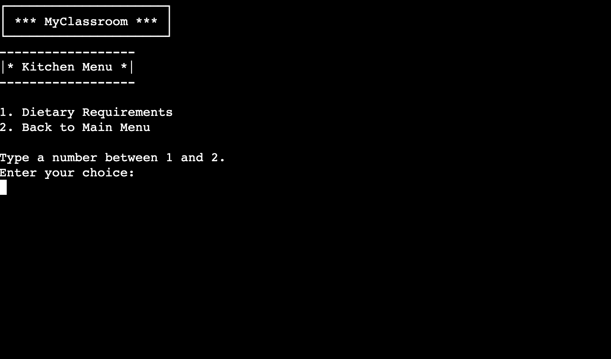
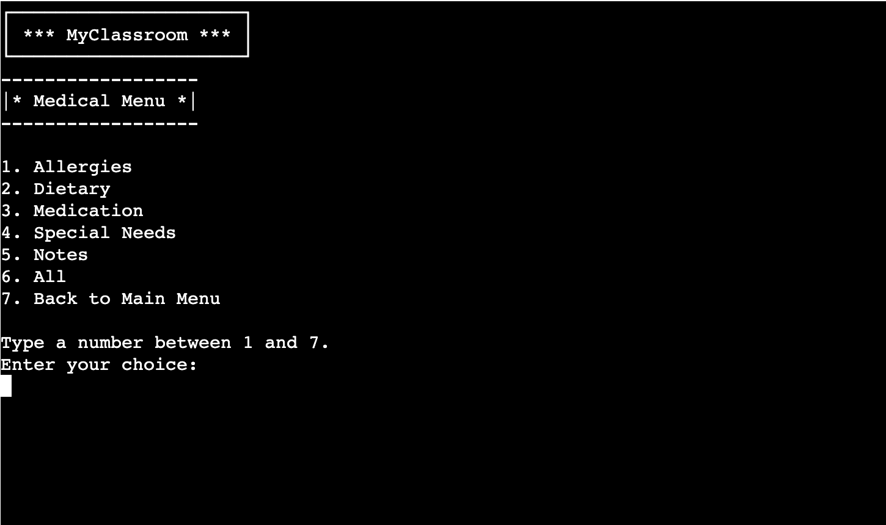
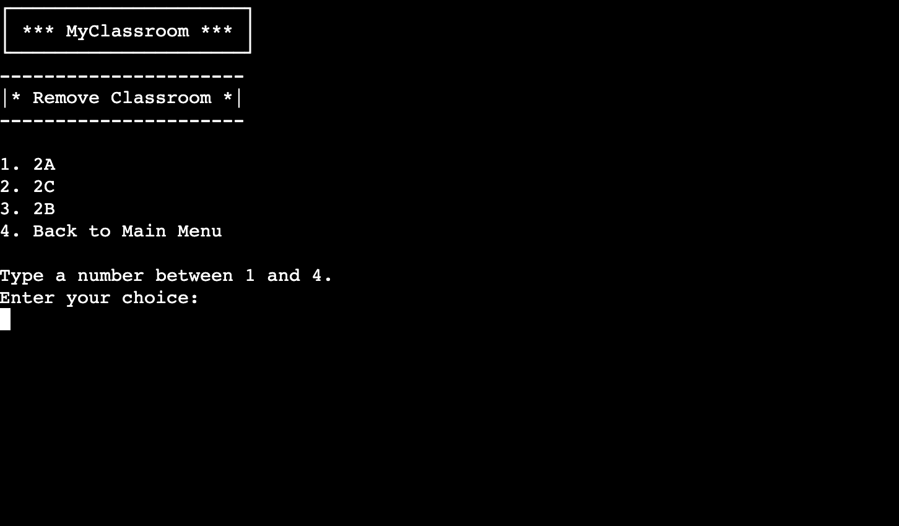

# Testing

This project was built using [Code Institute Project Template](https://github.com/Code-Institute-Org/p3-template). HTML and JavaScript were provided with it. Therefore, no HTML, JavaScript, or browser compatibility tests were conducted.

## PEP8 Validation

## Manual Testing

## Testing User Stories

- **As a teacher, I want easy access to a classroom overview with all students listed.**
  - The Classroom submenu has been implemented and is accessible from the main menu.

    

  - You can select a single classroom from the menu, and it will be displayed on the screen.

    

- **As a teacher, I want the ability to filter children who may require additional assistance in the class.**
  - The Classroom submenu offers a menu option to display the classroom table with filtering options for children who need extra attention during classes.

    

- **As a kitchen worker, I need access to any additional dietary requirements before preparing meals for the school.**
  - The Kitchen submenu is available, filtering all children with any dietary requirements and allergies, and displays a table for the entire school.

   

- **As a teacher or medical personnel, I want to be able to filter all children in school based on specific criteria such as allergies, dietary requirements, medications, or special needs.**
  - The Classroom submenu provides filtering options for each medical section, including allergies, dietary requirements, medications, special needs, and medical notes. It also shows a full table with all these requirements for the whole school.

    

- **As a teacher, I want to add a new student to the classroom.**
  - The Admin submenu includes an option to add a new student with a step-by-step interface guiding the teacher through entering each entry.

    

- **As a teacher, I want to create a new classroom.**
  - The Admin submenu offers an option to add a new classroom, validating if a classroom with that name already exists, thus preventing duplicate classroom creations.

    

- **As a teacher, I want to remove a student from the class.**
  - The Admin submenu provides an option to search for a student, returning a list of students (or multiple students if there are duplicates) and allowing the teacher to choose which student to remove.

    

- **As a teacher, I want to remove a classroom.**
  - The Admin submenu for removing classrooms lists all classrooms already created and offers the option to select which classroom the teacher would like to remove.

    

## Bugs

### Known Bugs